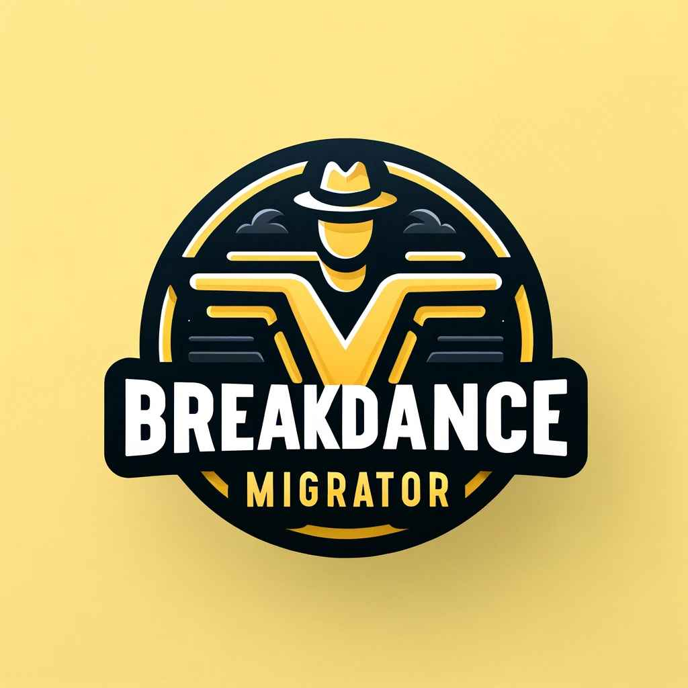

  
  <h1 align="center">Breakdance Migrator</h1>
  
Breakdance Migrator is a WordPress plugin designed to facilitate the migration of Breakdance Builder content from a staging site to a production site.

 

<!-- Roadmap -->

## Features

- Export and import Breakdance Builder content seamlessly.
- Export post types, postmeta, options, icons, and icon sets related to Breakdance.
- Compress exported JSON data to reduce file size and improve download performance.
- Interactive and user-friendly admin interface with confirmation prompts and loading indicators.
- Supports AJAX for efficient data export without page reloads.

## Installation

1. Download the Breakdance Migrator plugin.
2. Upload the plugin files to the `/wp-content/plugins/breakdance-migrator` directory, or install the plugin through the WordPress plugins screen directly.
3. Activate the plugin through the 'Plugins' screen in WordPress.
4. Navigate to the 'Breakdance Migrator' submenu under the 'Breakdance' menu in the WordPress admin dashboard.

## Usage

1. Go to the 'Breakdance Migrator' page in the WordPress admin dashboard.
2. Select the options you want to export (e.g., Export Icons).
3. Click the 'Export Data' button.
4. Download the exported JSON file or view it directly in your browser.

## Contribution

We welcome contributions from the community to help improve Breakdance Migrator. Here's how you can get involved:

1. **Report Bugs**: If you encounter any issues, please report them on our [GitHub Issues](https://github.com/slawomiroruba/breakdance-migrator/issues) page.
2. **Feature Requests**: Have a great idea for a new feature? Let us know by opening a feature request.
3. **Submit Pull Requests**: If you'd like to contribute code, fork the repository and submit a pull request with your changes.
4. **Documentation**: Help us improve our documentation by suggesting enhancements or adding new content.
5. **Spread the Word**: Share Breakdance Migrator with your network and help us grow our community.

or support me by buying a coffee ☕️   

## License

Breakdance Migrator is licensed under the MIT License. See the [LICENSE](https://github.com/slawomiroruba/breakdance-migrator/blob/main/LICENSE) file for more information.

---

Thank you for using Breakdance Migrator! We look forward to your contributions and feedback to make this plugin even better. Happy migrating!
